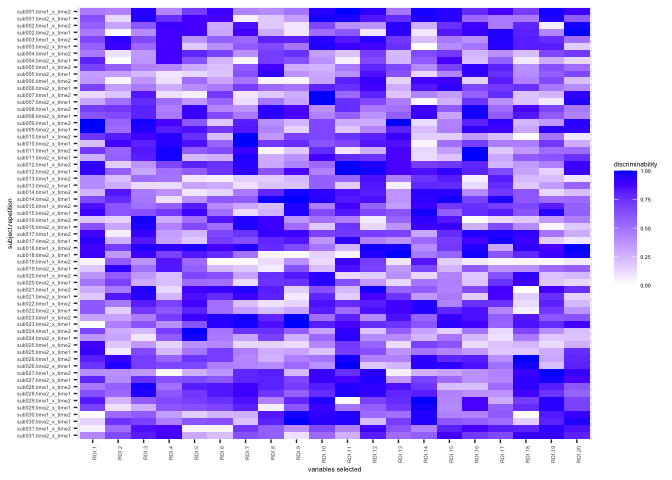

<!-- README.md is generated from README.Rmd. Please edit that file -->

# ReX

Reliability Explorer (ReX) - command line version

<!-- badges: start -->

[](https://github.com/TingsterX/ReX/actions/workflows/R-CMD-check.yaml)
<!-- badges: end -->

**ReX (Reliability Explorer)** is a R toolbox for calculating
reliability and mapping individual variations to facilitate the
assessment of reliability and reproducibility in neuroscience and
psychology. This toolbox provides two modules.

-   Reliability Calculation module. This module implements parametric
    and nonparametric methods for univariate and multivariate
    reliability calculation including Intraclass correlation (ICC),
    distance-based ICC (dbICC), Image Intraclass Correlation Coefficient
    (I2C2), discriminability, and identification rate
    (i.e. fingerprinting). The results will be presented in a
    two-dimensional individual variation space (x-axis:
    within-individual variation, y-axis: between-individual variation)
    to facilitate understanding of individual difference and its
    relation to reliability assessment. The discriminability of each
    observation can be used to inspect your data and results. It will
    help to detect (1) which variable of interest has low
    reliablity, (2) which observation is a potential outliers.

-   Individual Comparison module. This module provides plotting function
    to visualize your results in the two-dimensional individual
    variation space. For the paired comparison, ReX can calculate the
    gradient flow map provides the normalized change of the within- and
    between-individual variation as compared to the most efficient
    direction for improving ICC, which helps to guide optimization
    efforts for measurement of individual differences.

See
[**Tutorials**](https://github.com/TingsterX/Reliability_Explorer#tutorials)
and Shiny App version:
<https://github.com/TingsterX/Reliability_Explorer>

## Installation ReX in R

You can install the development version of ReX from GitHub with:

``` r
# install.packages("devtools")
devtools::install_github("TingsterX/ReX")
```

## Dependency packages

dplyr, lme4, ggplot2, RColorBrewer, scales, stats, reshape2, colorspace,
[I2C2](https://github.com/neuroconductor/I2C2)

## Run ReX using docker

#### Pull docker image

    docker pull tingsterx/rex:1.0.0

#### Usage of command line in docker, run

    docker run --rm \
         -v /local/path/to/your/data:/input \
         -v /local/path/to/your/output/:/output \
         tingsterx/rex:1.0.0

The help messages and demo code are also
[here](https://github.com/TingsterX/Reliability_Explorer/blob/main/rex_command_helper.md)

#### Run R in docker

    docker run -it --rm --entrypoint R \
         -v /local/path/to/your/data:/input \
         -v /local/path/to/your/output/:/output \
         tingsterx/rex:1.0.0

## Example - Reliability Calculation module

This is a basic example which shows you how to calculate different types
of reliability

``` r
library(ReX)
# demo data is included in ReX
head(demo_brain_trt[,1:8])
#>    subID visit age gender       ROI.1       ROI.2       ROI.3       ROI.4
#> 1 sub001 time1  26      M -0.17105600  0.05934696 -0.07569620 -0.13993092
#> 2 sub001 time2  26      M -0.07177064 -0.15806658 -0.09585763  0.02516391
#> 3 sub002 time1  30      M -0.25261160  0.15716580 -0.01088339 -0.25046000
#> 4 sub002 time2  30      M -0.15065471 -0.20617760 -0.17913395 -0.28043227
#> 5 sub003 time1  38      F -0.24426076 -0.26057101 -0.39224511 -0.34416539
#> 6 sub003 time2  38      F -0.16579377 -0.23880201 -0.27823357 -0.31587505
```

In this example, we only illustrate 20 dependent variables from the demo
data here

``` r
data <- as.matrix(demo_brain_trt[,5:24])
subID <- as.matrix(demo_brain_trt[,"subID"])        
session <- as.matrix(demo_brain_trt[,"visit"])         
cov <- as.matrix(demo_brain_trt[,c("age", "gender")])
```

#### Univariable Reliability - Intraclass Correlation (ICC) and variation field map

``` r
# Calculate the univariable Reliability: Demonstrate One-way Random Model based ICC
df_icc <- data.frame(lme_ICC_1wayR(data, subID, session, cov))
#> [1] "Running LMM for 5.00 present ..."
#> boundary (singular) fit: see help('isSingular')
head(df_icc)
#>              ICC       ICCk    sigma2_b   sigma2_w   var.data error.message
#> ROI.1 0.20704401 0.34305959 0.005238936 0.02006455 0.02537167             0
#> ROI.2 0.04698971 0.08976155 0.001015134 0.02058820 0.02127059             0
#> ROI.3 0.64010940 0.78056915 0.018732651 0.01053211 0.02594836             0
#> ROI.4 0.39197004 0.56318747 0.008752628 0.01357721 0.02105680             0
#> ROI.5 0.31462057 0.47864848 0.007041670 0.01533980 0.02380350             0
#> ROI.6 0.29384289 0.45421726 0.005162441 0.01240627 0.01862917             0
# The within- and between-individual variation map
rex_plot.var.field(df_icc, size.point = 4,  alpha.density = 0.3, color.point.fill = "red", color="red")
```


#### Univariable Reliability - Discriminability

``` r
# Calculate the univariable Reliability Discriminability
Discr_list <- discriminability_wraper(data, subID, session, all_discr.return=TRUE)
#> [1] 62
#> [1] 2
# Discriminability for each dependent variable
head(Discr_list$Discr)
#>       discriminability
#> ROI.1        0.5565574
#> ROI.2        0.4650538
#> ROI.3        0.6341398
#> ROI.4        0.5521505
#> ROI.5        0.5879032
#> ROI.6        0.5252688
# Discriminability for each observation and dependent variable
head(Discr_list$DiscrSub[1:6,1:6])
#>    subID   combination     ROI.1      ROI.2     ROI.3     ROI.4
#> 1 sub001 time1_x_time2 0.4666667 0.43333333 0.9500000 0.4166667
#> 2 sub001 time2_x_time1 0.6333333 0.13333333 0.9666667 0.7500000
#> 3 sub002 time1_x_time2 0.5666667 0.31666667 0.6000000 0.9000000
#> 4 sub002 time2_x_time1 0.4666667 0.01666667 0.4000000 0.8833333
#> 5 sub003 time1_x_time2 0.6666667 0.93333333 0.6500000 0.8833333
#> 6 sub003 time2_x_time1 0.5666667 0.90000000 0.5333333 0.8833333
# Inspect the Discriminability for each observation and dependent variable
rex_plot.discri_matrix(Discr_list$DiscrSub[,-c(1,2)], Discr_list$DiscrSub[,1], Discr_list$DiscrSub[,2])
```



#### Univariable Reliability - Identification Rate (Fingerprinting)

``` r
iRate_list <- fingerprinting_wraper(data, subID, session, method.dist = 'euclidean')
head(iRate_list$FP)
#>       fingerprinting
#> ROI.1     0.03225806
#> ROI.2     0.00000000
#> ROI.3     0.00000000
#> ROI.4     0.00000000
#> ROI.5     0.00000000
#> ROI.6     0.00000000
```

#### Multivariable reliability (reliability for all dependent variables together)

``` r
# All multivariable reliability are based on the distance matrix
Dmax <- dist(data, method = "euclidean")

# I2C2
calc_i2c2(Dmax, subID, as.matrix(session))
#> [1] 0.3311749

# dbICC
calc_dbICC(Dmax, subID)
#> [1] 0.1913023

# discriminability
calc_discriminability(Dmax, subID)
#> [1] 0.7223118

# identification rate (fingerprinting)
calc_fingerprinting(Dmax, subID)
#> [1] 0.03225806

# plot the distance space (red shade: discriminated observations, red dot: identified observation)
dFM.df <- distance_field_map.df(Dmax, subID)
rex_plot.distance_field_map(dFM.df, point.size = 2)
```


# Example - Individual Comparison module

Demo data included in ReX: reliability and variation of brain
connectivity preprocessed with and without global signal regression
(GSR).

``` r
# 62 observations includes 31 subjects and 2 visits per subject
df_baseline <- demo_icc_noGSR
df_target <- demo_icc_GSR
df_paired <- cbind(df_baseline, df_target)
# calculate the normalized changes of variation - gradient flow 
df_VarPairedComp <- icc_gradient_flow(df_target[,"sigma2_w"], df_target[,"sigma2_b"], df_baseline[,"sigma2_w"], df_baseline[,"sigma2_b"])
df_VarPairedComp$contrast <- "GSR - noGSR"
rownames(df_VarPairedComp) <- df_paired$X
head(df_VarPairedComp)
#>       delta.sigma2_w delta.sigma2_b delta.theta delta.sigma2_w_norm
#> V1_L    0.0067027234   0.0041337102   0.5526237         0.002800307
#> MST_L   0.0069396022  -0.0036147009   5.8029735         0.007812760
#> V6_L   -0.0008516454  -0.0014259651   4.1740003        -0.001146563
#> V2_L    0.0051266349  -0.0011036842   6.0711374         0.005140554
#> V3_L    0.0055806057  -0.0001105027   6.2633867         0.005539193
#> V4_L    0.0060191643  -0.0020029545   5.9619482         0.005864097
#>       delta.sigma2_b_norm delta.theta_norm    contrast
#> V1_L         0.0073601864       1.20724146 GSR - noGSR
#> MST_L        0.0004300274       0.05498619 GSR - noGSR
#> V6_L        -0.0012016940       3.95046375 GSR - noGSR
#> V2_L        -0.0010369238       6.08414181 GSR - noGSR
#> V3_L         0.0006875364       0.12349052 GSR - noGSR
#> V4_L        -0.0024196136       5.89185158 GSR - noGSR
```

#### Change of the variation

Change of the within- and between-individual variation: target (GSR) vs
baseline (noGSR)

``` r
rex_plot.var.change(df_VarPairedComp)
```


#### Normalized change of the variation - gradient flow

Normalized (relative) change of the within- and between-individual
variation: target (GSR) vs baseline (noGSR)

``` r
rex_plot.icc.gradient.norm(df_VarPairedComp)
```


``` r
# Hisgotram of normalized change of the variation - gradient flow: target vs baseline
rex_plot.icc.gradient.hist(df_VarPairedComp)
```


#### version note

v1.0.0 - July 10 2022

v1.0.1 - Sep 20 2020

-   fix bug: If input data contains NA in
    Discriminability/Fingerprinting calculation (listwise delete)
-   fix bug: If input data contains \>2 visits per subject in
    Discriminability/Fingerprinting calculation
